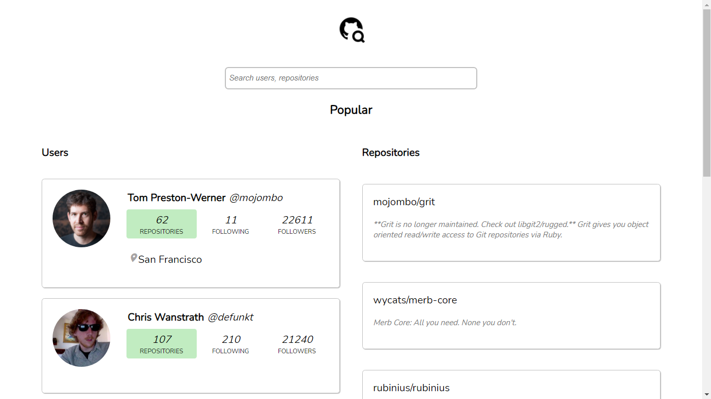
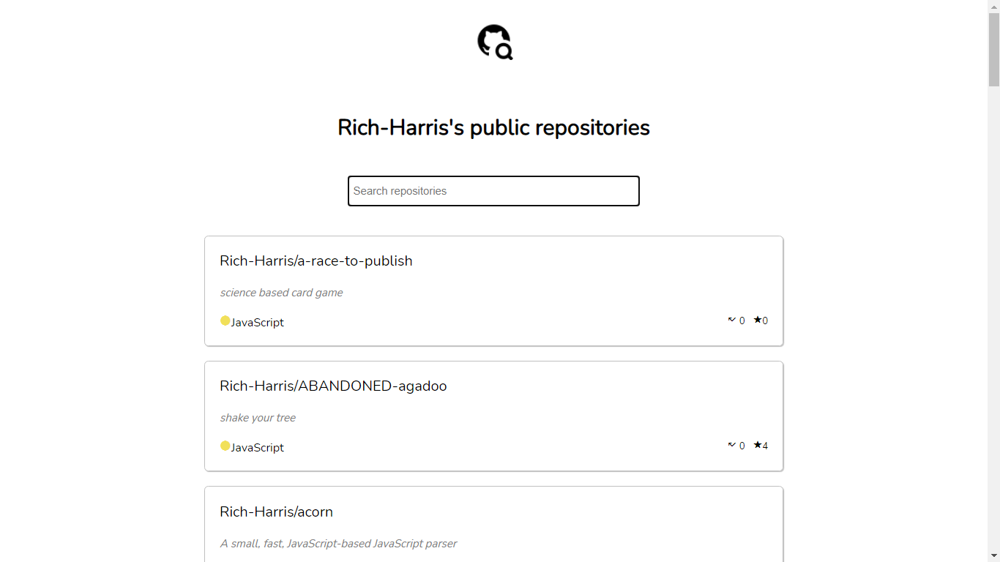
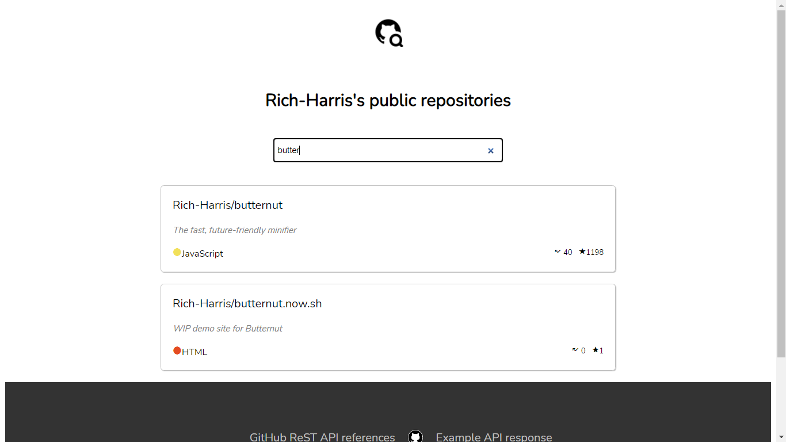

## GitHub - Search users and respositories

https://gh-search-users-repos.netlify.app

 

- Search users
- Search repositories
- Display user's repositories (Language, number of forks, number of stargazers)

The application opens with a search box and lists of popular users and repositories.
- https://api.github.com/repositories 
- https://api.github.com/users

Upon entering text into the search box, the users and repositories matching the search string are fetched and displayed using 
https://api.github.com/search/users?q= and 
https://api.github.com/search/repositories?q=

User's details are fetched using https://api.github.com/users/:username

Upon clicking on a user's repositories (from users list), their repositories are displayed. 

And finally, you can search through the user's repositories (Impl using JavaScript's array methods)

Styling using CSS - flexbox, grid
